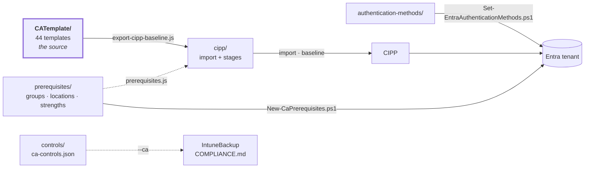

[Nederlands](README.md) · **English** · [Français](README.fr.md)

# CA-Policies

`CATemplate/` is the source: the agreed Conditional Access policies in CIPP template format
(a Table Storage row with a nested `JSON` string), numbered `CXNM__STANDARD__1xxx` BLOCK, `2xxx` GRANT
and `3xxx` SESSION. 44 templates. The numbering and the layout come from Daniel Chronlund's CA design;
why everything is called `CXNM - STANDARD` and there are no personas is explained in [`ANALYSE.en.md`](docs/ANALYSE.en.md#why-there-are-no-personas).



**[STRUCTUUR.en.md](docs/STRUCTUUR.en.md)** is the map: which folder holds what, which script reads
and writes what, and how this repo is tied to the IntuneBackup repo.

**[ANALYSE.en.md](docs/ANALYSE.en.md)** records where the templates come from, what they have been
checked against (MCSB, CIS, Microsoft's own templates, j0eyv) and — more importantly — what is
deliberately *not* in them and why.

Each folder has a README with the details: [`CATemplate/`](CATemplate/README.en.md) (every policy, generated),
[`prerequisites/`](prerequisites/README.en.md), [`controls/`](controls/README.en.md), [`cipp/`](cipp/README.en.md),
[`authentication-methods/`](authentication-methods/README.en.md) and [`scripts/`](scripts/README.en.md).

## What sits next to the CA policies

`CATemplate/` is not the whole story. Three folders next to it carry what a CA policy needs
but is not itself:

| Folder | What it holds | Guarded by |
|---|---|---|
| [`prerequisites/`](prerequisites/README.en.md) | Groups, named locations, custom authentication strengths and authentication contexts that templates refer to | `scripts/prerequisites.js`, blocking in CI |
| [`authentication-methods/`](authentication-methods/README.en.md) | Which sign-in methods are enabled, and the passkey profiles | `scripts/authentication-methods.js`, blocking in CI |
| [`controls/`](controls/README.en.md) | Per template, which ISO 27001, NIS2, CIS and NIST CSF controls it fulfils | `scripts/check-controls.js`, blocking in CI |

Two dependencies run from `authentication-methods/` to here, and both fail silently —
`2120` demands a phishing-resistant method that is not there, or `2180` demands a Temporary Access
Pass that is disabled. The validator checks exactly those two against the actual `state` of those
templates.

## Adding a policy

1. Put the template in `CATemplate/` as `CXNM__STANDARD__<number>__<BLOCK|GRANT|SESSION>__<Name>.json`.
2. Does the policy require a licence, or is it a per-tenant decision? Then put it in
   [`CATemplate/_manifest.json`](CATemplate/_manifest.json) with `optional: true` and a `reden`.
   It then goes to stage 3 and stays on Report there.
3. Does the template refer to a group or named location? Make sure it is in
   `prerequisites/ca-prerequisites.json` — otherwise the export refuses to run.
4. Give it a standards mapping in `controls/ca-controls.json` — which ISO, NIS2, CIS and
   CSF controls this policy fulfils. `scripts/check-controls.js` rejects a template without one.
5. Run the pipeline from [`scripts/README.en.md`](scripts/README.en.md#order).

**On a change in `CATemplate/`:** `.github/workflows/generate-cipp.yml` regenerates
`cipp/*.json` and opens a PR for it — check the diff before you merge. The same workflow
runs on the PR itself (*without* opening a PR): a missing prerequisite or mapping breaks
there, while you still remember what you meant.

**What does *not* move along by itself**, not even after a green PR:

| | |
|---|---|
| `optional` in `_manifest.json` | a licence-bound template you forget there silently lands in stage 1 or 2 — nothing fails on it |
| The baseline *in* CIPP | `cipp/baseline-stages.json` is a file; the baseline in CIPP is a separate copy that someone updates |
| The tenants | a template that introduces a new group or location requires `New-CaPrerequisites.ps1`, per tenant |
| The id of a custom authentication strength | Entra determines it on creation, so the template carries a placeholder (zero GUID). `New-CaPrerequisites.ps1` creates the strength and reports the real id; that has to go into the CIPP deployment by hand. Currently `2180`, `2185` and `2190` |
| Passkey profiles | the opt-in is irreversible and management goes through the portal. `Set-EntraAuthenticationMethods.ps1` reports the difference but does not set them — see [`authentication-methods/`](authentication-methods/README.en.md) |

## Deploying via CIPP

`scripts/export-cipp-baseline.js` turns the templates into two files:

| File | What it holds |
|---|---|
| `cipp/ca-templates-import.json` | the templates in CIPP's CATemplate table form, GUID unchanged, without tenant-specific values |
| `cipp/baseline-stages.json` | per template the stage, the state and the action (Report / Remediate), plus what blocks the deployment |

A CIPP baseline does not consist of policies but of *standards*: each template is one instance of
the standard **Conditional Access Template** in a stage, with a template GUID, a state and an
action. `cipp/baseline-stages.json` is that list, in our own format — the schema that CIPP's
Baselines screen itself stores is version-bound and is therefore deliberately not pinned down.

The stage layout follows the metadata the repo already has:

| Stage | What goes in | Deployed as |
|---|---|---|
| 1 — Core | `state: enabled`, not optional (17) | `enabled` |
| 2 — Tightening | `disabled` or report-only in the template (12) | report-only |
| 3 — Tenant choice and licence | `optional: true` in `_manifest.json` (15) | report-only, stays on Report |

### Prerequisites first, only then Remediate

The templates refer to eleven groups, four named locations and three custom authentication
strengths that no tenant has
by default. If they are missing, that fails in the wrong direction: **an exclusion group
that does not exist excludes nobody**, so the policy becomes stricter than intended and nothing raises
an alarm. Two cases are not "stricter" but "locked out":

- `Excluded from Conditional Access` and `SG-U-CA-Exclude-Breakglass` both appear in 38 of
  the 44 templates — one break-glass exclusion under two names, so that a tenant does not have
  to rename anything to follow the convention it already uses. The six without it target
  workload and agent identities (`includeUsers: "None"`), so they affect nothing there.
  Both empty = no break-glass; one of the two empty is more treacherous, because then the
  exclusion *looks* taken care of. `-BreakGlassUserId` therefore fills both.
- `Licensed Users` — 1110 is `enabled` and blocks `All` except this group. Created static
  or empty, that blocks *every* user in the tenant. It must be dynamic.

Therefore:

```powershell
./scripts/New-CaPrerequisites.ps1 -TenantId <tenant> -WhatIf          # look first
./scripts/New-CaPrerequisites.ps1 -TenantId <tenant> `
    -ServiceAccountIpRange '<cidr of this tenant>' -AllowedCountry 'NL','BE' `
    -BreakGlassUserId '<object-id>' -RequireSafeToDeploy              # then create
```

The script is idempotent and exits with an error as long as the critical groups are empty.
Only once it exits green may stage 1 enforce:

```bash
node scripts/export-cipp-baseline.js --remediate-stage1
```

Without that flag *every* standard is on `Report`, and that is also what CI generates.

That flag refuses as long as there are templates **new in stage 1** compared to the previous
export. Stage 1 derives itself from `state: enabled`, so a template you add today
falls into it automatically; without that brake, "I added a file" would coincide
with "this gets enforced in every tenant". The script names which ones, and `--accept-new`
confirms them. Does something not belong in stage 1: set the template to `disabled` (stage 2) or to
`optional` in `_manifest.json` (stage 3).

What that brake does *not* know: what is actually in CIPP and in the tenants — that is the
truth there, not here. It compares against the previous export in this repo, and so catches the
addition at the author, not at the deployment. Three templates stay on Report regardless, because
their prerequisite cannot come from this repo: `1040` (that tenant's country list), `1060` (that
tenant's IP ranges) and `1180` (the compliant network location that Entra only provides with Global
Secure Access).

`prerequisites/ca-prerequisites.json` is the source for both scripts. `scripts/prerequisites.js`
fails on every reference without a definition, and on a named location whose content in the
template differs from the definition: CIPP creates a missing location from the template,
`New-CaPrerequisites.ps1` from `prerequisites/` — so those two must stay identical.

## Accountability to ISO 27001, NIS2, CIS and NIST CSF

`controls/ca-controls.json` states per policy which controls it technically fulfils. That file is
not a document in itself: it feeds `COMPLIANCE.md` in the IntuneBackup repo, which puts the Intune
and the CA side into one matrix — per ISO/IEC 27001:2022 Annex A control, per NIS2 measure (art. 21
para. 2), per CIS Controls v8.1 safeguard and per NIST CSF 2.0 subcategory. That repo should be
cloned next to this one, as `../IntuneBackup`:

```bash
cd ../IntuneBackup
node scripts/generate-compliance.js --strict --ca ../CA-Policies/controls/ca-controls.json
```

Without `--ca` — and that is what is in git there, because that is what CI regenerates there — that
matrix lacks the CA side. That matters most for NIS2 (j), multi-factor authentication and secured
communication: that point depends almost entirely on this repo and hardly on Intune.

The phase does not come from a manifest but from `state` in the template itself: `enabled` counts as
enforced, report-only as prepared, `disabled` as not deployed. A policy in report-only
therefore does not count as covered — it does nothing, and that is how an auditor should see it too.

The vocabulary (the exact labels) lives in `IntuneTemplate/_controls.json` in that other repo.
`check-controls.js` checks the labels against it when that repo is next to this one; in CI it cannot,
and `generate-compliance.js --strict` does it there.

**What this is *not*:** a statement that an organisation is ISO certified or NIS2 compliant. This
says what the baseline enforces, not what a tenant does, and both frameworks require governance,
risk management, supply-chain agreements and incident reporting that no CA policy can fulfil.
