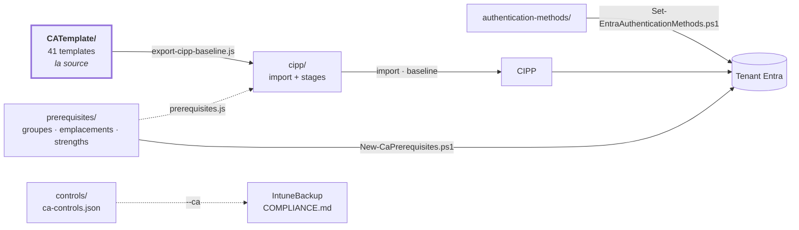

[Nederlands](README.md) · [English](README.en.md) · **Français**

# CA-Policies

`CATemplate/` est la source : les stratégies Conditional Access convenues au format de template CIPP
(ligne Table Storage avec une chaîne `JSON` imbriquée), numérotées `GLOBAL__1xxx` BLOCK, `2xxx` GRANT
et `3xxx` SESSION. 41 templates. La numérotation et l'organisation viennent de la conception CA de
Daniel Chronlund ; pourquoi tout s'appelle `GLOBAL__` et pourquoi il n'y a pas de personas est
expliqué dans [`ANALYSE.fr.md`](docs/ANALYSE.fr.md#pourquoi-il-ny-a-pas-de-personas).



**[STRUCTUUR.fr.md](docs/STRUCTUUR.fr.md)** est le plan : quel dossier contient quoi, quel script
lit et écrit quoi, et comment ce dépôt est relié au dépôt IntuneBackup.

**[ANALYSE.fr.md](docs/ANALYSE.fr.md)** consigne d'où viennent les templates, à quoi ils ont été
confrontés (MCSB, CIS, les propres templates de Microsoft, j0eyv) et — plus important — ce qui n'y
figure volontairement *pas*, et pourquoi.

Chaque dossier a un README avec les détails : [`scripts/`](scripts/README.fr.md) et
[`authentication-methods/`](authentication-methods/README.fr.md).

## Ce qui se trouve à côté des stratégies CA

`CATemplate/` n'est pas toute l'histoire. Trois dossiers à côté portent ce dont une stratégie CA a
besoin sans en faire elle-même partie :

| Dossier | Contenu | Surveillé par |
|---|---|---|
| [`prerequisites/`](prerequisites/ca-prerequisites.json) | Groupes, named locations, custom authentication strengths et authentication contexts auxquels les templates font référence | `scripts/prerequisites.js`, bloquant en CI |
| [`authentication-methods/`](authentication-methods/README.fr.md) | Quelles méthodes d'authentification sont activées, et les profils passkey | `scripts/authentication-methods.js`, bloquant en CI |
| [`controls/`](controls/ca-controls.json) | Par template, quels contrôles ISO 27001, NIS2, CIS et NIST CSF il couvre | `scripts/check-controls.js`, bloquant en CI |

Deux dépendances vont de `authentication-methods/` vers ici, et échouent toutes deux en silence —
`2120` exige une méthode résistante au phishing qui n'existe pas, ou `2180` exige un Temporary Access
Pass qui est désactivé. Le validateur contrôle précisément ces deux-là par rapport au `state` réel de
ces templates.

## Ajouter une stratégie

1. Placez le template dans `CATemplate/` sous `GLOBAL__<numéro>__<BLOCK|GRANT|SESSION>__<Nom>.json`.
2. La stratégie exige-t-elle une licence ou est-elle une décision par tenant ? Ajoutez-la alors dans
   [`CATemplate/_manifest.json`](CATemplate/_manifest.json) avec `optional: true` et une `reden`.
   Elle passe alors au stage 3 et y reste sur Report.
3. Le template fait-il référence à un groupe ou à une named location ? Assurez-vous qu'il figure dans
   `prerequisites/ca-prerequisites.json` — sinon l'export refuse de s'exécuter.
4. Donnez-lui un mapping de normes dans `controls/ca-controls.json` — quels contrôles ISO, NIS2, CIS
   et CSF cette stratégie couvre. `scripts/check-controls.js` refuse un template sans mapping.
5. Exécutez le pipeline de [`scripts/README.fr.md`](scripts/README.fr.md#ordre-dexécution).

**Lors d'une modification dans `CATemplate/` :** `.github/workflows/generate-cipp.yml` régénère
`cipp/*.json` et ouvre une PR pour cela — vérifiez le diff avant de merger. Le même workflow
s'exécute sur la PR elle-même (*sans* ouvrir de PR) : un prérequis ou un mapping manquant y
échoue, pendant que vous savez encore ce que vous vouliez faire.

**Ce qui ne suit *pas* automatiquement**, même après une PR verte :

| | |
|---|---|
| `optional` dans `_manifest.json` | un template soumis à licence que vous y oubliez atterrit en silence au stage 1 ou 2 — rien n'y échoue |
| La baseline *dans* CIPP | `cipp/baseline-stages.json` est un fichier ; la baseline dans CIPP est une copie distincte que quelqu'un met à jour |
| Les tenants | un template qui introduit un nouveau groupe ou emplacement demande `New-CaPrerequisites.ps1`, par tenant |
| L'id d'une custom authentication strength | Entra le détermine à la création, donc le template porte un placeholder (GUID nul). `New-CaPrerequisites.ps1` crée la strength et indique l'id réel ; celui-ci doit être reporté à la main dans le déploiement CIPP. Aujourd'hui uniquement `2180` |
| Passkey profiles | l'opt-in est irréversible et la gestion passe par le portail. `Set-EntraAuthenticationMethods.ps1` signale l'écart, mais ne les définit pas — voir [`authentication-methods/`](authentication-methods/README.fr.md) |

## Déployer via CIPP

`scripts/export-cipp-baseline.js` produit deux fichiers à partir des templates :

| Fichier | Contenu |
|---|---|
| `cipp/ca-templates-import.json` | les templates sous la forme de table CATemplate de CIPP, GUID inchangé, sans valeurs propres au tenant |
| `cipp/baseline-stages.json` | par template, le stage, le state et l'action (Report / Remediate), plus ce qui bloque le déploiement |

Une baseline CIPP ne se compose pas de stratégies mais de *standards* : chaque template correspond à
une occurrence du standard **Conditional Access Template** dans un stage, avec un GUID de template, un
state et une action. `cipp/baseline-stages.json` est cette liste, dans notre propre format — le schéma
que l'écran Baselines de CIPP enregistre lui-même dépend de la version et n'est donc volontairement
pas figé.

La répartition en stages suit les métadonnées que le dépôt possède déjà :

| Stage | Contenu | Déployé comme |
|---|---|---|
| 1 — Socle | `state: enabled`, non optionnel (17) | `enabled` |
| 2 — Renforcement | `disabled` ou report-only dans le template (12) | report-only |
| 3 — Choix du tenant et licence | `optional: true` dans `_manifest.json` (12) | report-only, reste sur Report |

### D'abord les prérequis, ensuite seulement Remediate

Les templates font référence à huit groupes et quatre named locations qu'aucun tenant ne possède
d'office. S'ils manquent, l'échec se produit dans le mauvais sens : **un groupe d'exclusion qui
n'existe pas n'exclut personne**, donc la stratégie devient plus stricte que prévu et rien ne donne
l'alerte. Deux cas ne sont pas alors « plus stricts » mais « fermés » :

- `Excluded from Conditional Access` et `SG-U-CA-Exclude-Breakglass` figurent tous deux dans 35 des
  41 templates — une seule exclusion break-glass sous deux noms, pour qu'un tenant n'ait rien à
  renommer pour suivre la convention qu'il applique déjà. Les six qui ne les ont pas visent des
  identités de workload et d'agent (`includeUsers: "None"`), donc ils n'y touchent rien.
  Les deux vides = pas de break-glass ; l'un des deux vide est plus insidieux, car l'exclusion
  *semble* alors réglée. `-BreakGlassUserId` les remplit donc tous les deux.
- `Licensed Users` — 1110 est sur `enabled` et bloque `All` sauf ce groupe. Créé statique ou vide,
  cela bloque *chaque* utilisateur du tenant. Il doit être dynamique.

C'est pourquoi :

```powershell
./scripts/New-CaPrerequisites.ps1 -TenantId <tenant> -WhatIf          # d'abord regarder
./scripts/New-CaPrerequisites.ps1 -TenantId <tenant> `
    -ServiceAccountIpRange '<cidr van deze tenant>' -AllowedCountry 'NL','BE' `
    -BreakGlassUserId '<object-id>' -RequireSafeToDeploy              # puis créer
```

Le script est idempotent et se termine en erreur tant que les groupes critiques sont vides. Ce n'est
que lorsqu'il se termine au vert que le stage 1 peut être appliqué :

```bash
node scripts/export-cipp-baseline.js --remediate-stage1
```

Sans cet indicateur, *chaque* standard est sur `Report`, et c'est aussi ce que génère la CI.

Cet indicateur refuse tant que des templates sont **nouveaux au stage 1** par rapport à l'export
précédent. Le stage 1 se déduit lui-même de `state: enabled`, donc un template que vous ajoutez
aujourd'hui y tombe automatiquement ; sans ce frein, « j'ai ajouté un fichier » reviendrait à « ceci
est appliqué dans chaque tenant ». Le script indique lesquels, et `--accept-new` les confirme. Si
quelque chose n'a pas sa place au stage 1 : mettez le template sur `disabled` (stage 2) ou sur
`optional` dans `_manifest.json` (stage 3).

Ce que ce frein *ne* sait *pas* : ce qui se trouve réellement dans CIPP et dans les tenants — la
vérité est là-bas, pas ici. Il compare avec l'export précédent dans ce dépôt, et intercepte donc
l'ajout chez l'auteur, pas au déploiement. Trois templates restent de toute façon sur Report, parce
que leur prérequis ne peut pas venir de ce dépôt : `1040` (la liste de pays de ce tenant), `1060` (les
plages IP de ce tenant) et `1180` (l'emplacement compliant network qu'Entra ne fournit qu'avec Global
Secure Access).

`prerequisites/ca-prerequisites.json` est la source des deux scripts. `scripts/prerequisites.js`
échoue sur toute référence sans définition, et sur une named location dont le contenu dans le
template diffère de la définition : CIPP crée un emplacement manquant à partir du template,
`New-CaPrerequisites.ps1` à partir de `prerequisites/` — les deux doivent donc rester identiques.

## Justification vis-à-vis d'ISO 27001, NIS2, CIS et NIST CSF

`controls/ca-controls.json` indique par stratégie quels contrôles elle couvre techniquement. Ce
fichier n'est pas un document en soi : il alimente `COMPLIANCE.md` dans le dépôt IntuneBackup, qui
place le volet Intune et le volet CA dans une seule matrice — par contrôle de l'Annexe A d'ISO/IEC
27001:2022, par mesure NIS2 (art. 21, par. 2), par safeguard CIS Controls v8.1 et par sous-catégorie
NIST CSF 2.0. Ce dépôt doit être cloné à côté de celui-ci, sous `../IntuneBackup` :

```bash
cd ../IntuneBackup
node scripts/generate-compliance.js --strict --ca ../CA-Policies/controls/ca-controls.json
```

Sans `--ca` — et c'est ce qui est dans git là-bas, car c'est ce que la CI y régénère — cette matrice
n'a pas le volet CA. La différence est la plus grande pour NIS2 (j), authentification multifacteur et
communications sécurisées : ce point repose presque entièrement sur ce dépôt et à peine sur Intune.

La phase ne vient pas d'un manifeste mais du `state` dans le template lui-même : `enabled` compte
comme appliqué, report-only comme préparé, `disabled` comme non déployé. Une stratégie en report-only
ne compte donc pas comme couverte — elle ne fait rien, et c'est ainsi qu'un auditeur doit la voir.

Le vocabulaire (les libellés exacts) se trouve dans `IntuneTemplate/_controls.json` dans l'autre
dépôt. `check-controls.js` vérifie les libellés par rapport à celui-ci lorsque ce dépôt est à côté ;
en CI ce n'est pas possible, et c'est `generate-compliance.js --strict` qui s'en charge là-bas.

**Ce que ce n'est *pas* :** une affirmation qu'une organisation est certifiée ISO ou conforme à NIS2.
Ceci indique ce que la baseline applique, pas ce que fait un tenant, et les deux cadres demandent une
gouvernance, une gestion des risques, des accords avec la chaîne d'approvisionnement et une
notification des incidents qu'aucune stratégie CA ne peut couvrir.
