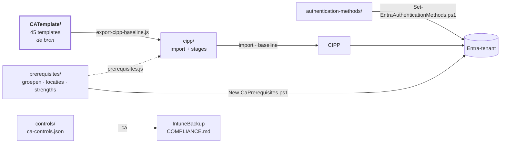

**Nederlands** · [English](README.en.md) · [Français](README.fr.md)

# CA-Policies

`CATemplate/` is de bron: de afgesproken Conditional Access-policies in CIPP-templateformaat
(Table Storage-rij met een genestelde `JSON`-string), genummerd `CA__1xxx` BLOCK, `2xxx` GRANT
en `3xxx` SESSION. 45 templates. De nummering en de indeling komen uit Daniel Chronlunds CA-ontwerp;
waarom alles één voorvoegsel draagt en er geen persona's zijn staat in [`ANALYSE.md`](docs/ANALYSE.md#waarom-er-geen-personas-zijn).



**[STRUCTUUR.md](docs/STRUCTUUR.md)** is de plattegrond: welke map wat bevat, welk script wat leest
en schrijft, en hoe deze repo aan de IntuneBackup-repo vastzit.

**[ANALYSE.md](docs/ANALYSE.md)** legt vast waar de templates vandaan komen, waartegen ze zijn
gelegd (MCSB, CIS, Microsofts eigen templates, j0eyv) en — belangrijker — wat er bewust *niet* in
zit en waarom.

Elke policy heeft een eigen README naast zijn JSON — wat hij doet, waar je op let, de normen en welke
Intune-policies hij raakt; de lijst staat in [`CATemplate/`](CATemplate/README.md).

Per map staat er een README met de details: [`CATemplate/`](CATemplate/README.md) (elke policy, gegenereerd),
[`prerequisites/`](prerequisites/README.md), [`controls/`](controls/README.md), [`cipp/`](cipp/README.md),
[`authentication-methods/`](authentication-methods/README.md) en [`scripts/`](scripts/README.md).

## Wat er naast de CA-policies staat

`CATemplate/` is niet het hele verhaal. Drie mappen en een databestand ernaast dragen wat een CA-policy nodig heeft
maar zelf niet is:

| Map | Wat erin staat | Bewaakt door |
|---|---|---|
| [`prerequisites/`](prerequisites/README.md) | Groepen, named locations, custom authentication strengths en authentication contexts waar templates naar verwijzen | `scripts/prerequisites.js`, blokkerend in CI |
| [`authentication-methods/`](authentication-methods/README.md) | Welke aanmeldmethodes aan staan, en de passkey-profielen | `scripts/authentication-methods.js`, blokkerend in CI |
| [`controls/`](controls/README.md) | Per template welke ISO 27001-, NIS2-, CIS- en NIST CSF-controls hij invult | `scripts/check-controls.js`, blokkerend in CI |
| [`docs/policies.json`](docs/policies.json) | Per template wat hij doet, de valkuilen, en van welke Intune-policies hij afhangt — de bron van de README per policy, en van de terugkoppeling bij elke Intune-policy in de IntuneBackup-repo | `scripts/generate-docs.js`, blokkerend in CI |

Twee afhankelijkheden lopen van `authentication-methods/` naar hier en falen allebei stil —
`2120` eist een phishing-bestendige methode die er niet is, of `2180` eist een Temporary Access
Pass die uit staat. De validator controleert precies die twee tegen de werkelijke `state` van die
templates.

## Een policy toevoegen

1. Zet het template in `CATemplate/` als `CA__<nummer>__<BLOCK|GRANT|SESSION>__<Naam>.json`.
2. Vraagt de policy een licentie of is hij een besluit per tenant? Zet hem dan in
   [`CATemplate/_manifest.json`](CATemplate/_manifest.json) met `optional: true` en een `reden`.
   Hij gaat dan naar stage 3 en blijft daar op Report.
3. Verwijst het template naar een groep of named location? Zorg dat die in
   `prerequisites/ca-prerequisites.json` staat — de export weigert anders te draaien.
4. Geef het een normenmapping in `controls/ca-controls.json` — welke ISO-, NIS2-, CIS- en
   CSF-controls deze policy invult. `scripts/check-controls.js` weigert een template zonder.
5. Beschrijf hem in `docs/policies.json`: een `doel` in nl, en en fr, de `letOp`-punten, en de
   Intune-policies waar hij van afhangt (`intune`). `scripts/generate-docs.js` weigert een template
   zonder doel.
6. Draai de pijplijn uit [`scripts/README.md`](scripts/README.md#volgorde).

**Bij een wijziging in `CATemplate/`:** `.github/workflows/generate-cipp.yml` regenereert
`cipp/*.json` en opent daar een PR voor — controleer de diff vóór je merget. Dezelfde workflow
draait op de PR zelf (zónder een PR te openen): een ontbrekende randvoorwaarde of mapping loopt
daar stuk, terwijl je nog weet wat je bedoelde.

**Wat níet vanzelf meebeweegt**, ook niet na een groene PR:

| | |
|---|---|
| `optional` in `_manifest.json` | een licentiegebonden template dat je daar vergeet belandt stil in stage 1 of 2 — daar faalt niets op |
| De baseline ín CIPP | `cipp/baseline-stages.json` is een bestand; de baseline in CIPP is een aparte kopie die iemand bijwerkt |
| De tenants | een template dat een nieuwe groep of locatie introduceert vraagt `New-CaPrerequisites.ps1`, per tenant |
| Het id van een custom authentication strength | Entra bepaalt het bij aanmaken, dus het template draagt een placeholder (nul-GUID). `New-CaPrerequisites.ps1` maakt de strength aan en meldt het echte id; dat moet met de hand in de CIPP-uitrol. Vandaag `2180`, `2185` en `2190` |
| Passkey profiles | de opt-in is onomkeerbaar en het beheer loopt via het portaal. `Set-EntraAuthenticationMethods.ps1` meldt het verschil, maar zet ze niet — zie [`authentication-methods/`](authentication-methods/README.md) |

## Uitrollen via CIPP

`scripts/export-cipp-baseline.js` maakt uit de templates twee bestanden:

| Bestand | Wat erin staat |
|---|---|
| `cipp/ca-templates-import.json` | de templates in CIPP's CATemplate-tabelvorm, GUID ongewijzigd, zonder tenant-specifieke waarden |
| `cipp/baseline-stages.json` | per template de stage, de state en de actie (Report / Remediate), plus wat de uitrol blokkeert |

Een CIPP-baseline bestaat niet uit policies maar uit *standards*: elk template is één keer de
standard **Conditional Access Template** in een stage, met een template-GUID, een state en een
actie. `cipp/baseline-stages.json` is die lijst, in ons eigen formaat — het schema dat CIPP's
Baselines-scherm zelf opslaat is versiegebonden en staat daarom bewust niet vastgelegd.

De stage-indeling volgt de metadata die de repo al heeft:

| Stage | Wat erin | Uitgerold als |
|---|---|---|
| 1 — Kern | `state: enabled`, niet optioneel (17) | `enabled` |
| 2 — Aanscherping | `disabled` of report-only in het template (12) | report-only |
| 3 — Tenantkeuze en licentie | `optional: true` in `_manifest.json` (15) | report-only, blijft op Report |

### Eerst de randvoorwaarden, dan pas Remediate

De templates verwijzen naar elf groepen, vier named locations en drie custom authentication
strengths die geen enkele tenant vanzelf heeft. Ontbreken ze, dan faalt dat de verkeerde kant op: **een uitzonderingsgroep
die niet bestaat sluit niemand uit**, dus de policy wordt strenger dan bedoeld en niets slaat
alarm. Twee gevallen zijn daarbij geen "strenger" maar "gesloten":

- `Excluded from Conditional Access` en `SG-U-CA-Exclude-Breakglass` staan allebei in 38 van
  de 45 templates — één break-glass-uitsluiting onder twee namen, zodat een tenant niets hoeft
  te hernoemen om de conventie te volgen die hij al voert. De zes zonder richten zich op
  workload- en agent-identiteiten (`includeUsers: "None"`), dus daar raken ze niets.
  Allebei leeg = geen break-glass; één van de twee leeg is verraderlijker, want dan líjkt de
  uitsluiting geregeld. `-BreakGlassUserId` vult ze daarom allebei.
- `Licensed Users` — 1110 staat op `enabled` en blokkeert `All` behalve deze groep. Statisch
  of leeg aangemaakt blokkeert dat élke gebruiker in de tenant. Hij moet dynamisch zijn.

Daarom:

```powershell
./scripts/New-CaPrerequisites.ps1 -TenantId <tenant> -WhatIf          # eerst kijken
./scripts/New-CaPrerequisites.ps1 -TenantId <tenant> `
    -ServiceAccountIpRange '<cidr van deze tenant>' -AllowedCountry 'NL','BE' `
    -BreakGlassUserId '<object-id>' -RequireSafeToDeploy              # dan aanmaken
```

Het script is idempotent en sluit met een fout af zolang de kritieke groepen leeg zijn.
Pas als het groen afsluit mag stage 1 afdwingen:

```bash
node scripts/export-cipp-baseline.js --remediate-stage1
```

Zonder die vlag staat élke standard op `Report`, en dat is ook wat CI genereert.

Die vlag weigert zolang er templates **nieuw in stage 1** staan ten opzichte van de vorige
export. Stage 1 leidt zichzelf af uit `state: enabled`, dus een template dat je vandaag
toevoegt valt daar vanzelf in; zonder die rem zou "ik heb een bestand toegevoegd" samenvallen
met "dit wordt in elke tenant afgedwongen". Het script noemt welke, en `--accept-new`
bevestigt ze. Hoort er iets niet in stage 1: zet het template op `disabled` (stage 2) of op
`optional` in `_manifest.json` (stage 3).

Wat die rem *niet* weet: wat er in CIPP en in de tenants daadwerkelijk staat — dat is daar de
waarheid, niet hier. Hij vergelijkt met de vorige export in deze repo, en vangt de toevoeging dus
af bij de auteur, niet bij de uitrol. Drie templates blijven hoe dan ook op Report, omdat hun
randvoorwaarde niet uit deze repo kan komen: `1040` (de landenlijst van die tenant), `1060` (de
IP-ranges van die tenant) en `1180` (de compliant-network-locatie die Entra pas levert bij Global
Secure Access).

`prerequisites/ca-prerequisites.json` is de bron voor beide scripts. `scripts/prerequisites.js`
faalt op elke verwijzing zonder definitie, en op een named location waarvan de inhoud in het
template afwijkt van de definitie: CIPP maakt een ontbrekende locatie aan uit het template,
`New-CaPrerequisites.ps1` uit `prerequisites/` — die twee moeten dus gelijk blijven.

## Verantwoording naar ISO 27001, NIS2, CIS en NIST CSF

`controls/ca-controls.json` zegt per policy welke controls hij technisch invult. Dat bestand is
geen document op zichzelf: het voedt `COMPLIANCE.md` in de IntuneBackup-repo, die de Intune- en
de CA-kant in één matrix zet — per ISO/IEC 27001:2022 Annex A-control, per NIS2-maatregel (art. 21
lid 2), per CIS Controls v8.1-safeguard en per NIST CSF 2.0-subcategorie. Die repo hoort naast
deze gekloond te zijn, als `../IntuneBackup`:

```bash
cd ../IntuneBackup
node scripts/generate-compliance.js --strict --ca ../CA-Policies/controls/ca-controls.json
```

Zonder `--ca` — en dat is wat daar in git staat, want dat is wat CI daar regenereert — mist die
matrix de CA-kant. Dat scheelt het meest bij NIS2 (j), multifactorauthenticatie en beveiligde
communicatie: dat punt hangt vrijwel helemaal aan deze repo en nauwelijks aan Intune.

De fase komt niet uit een manifest maar uit `state` in het template zelf: `enabled` telt als
afgedwongen, report-only als voorbereid, `disabled` als niet uitgerold. Een policy in report-only
telt dus niet als afgedekt — hij doet niets, en zo hoort een auditor hem ook te zien.

De vocabulaire (de exacte labels) staat in `IntuneTemplate/_controls.json` in die andere repo.
`check-controls.js` toetst de labels daartegen als die repo ernaast staat; in CI kan dat niet, en
doet `generate-compliance.js --strict` het daar.

**Wat dit níet is:** een uitspraak dat een organisatie ISO-gecertificeerd of NIS2-conform is. Dit
zegt wat de baseline afdwingt, niet wat een tenant doet, en beide kaders vragen governance,
risicobeheer, ketenafspraken en incidentmelding die met geen enkele CA-policy in te vullen zijn.
