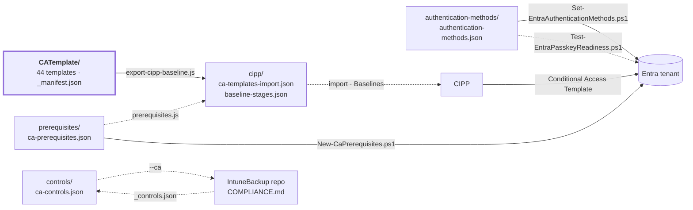

[Nederlands](STRUCTUUR.md) · **English** · [Français](STRUCTUUR.fr.md)

# Structure and connections

How this repo fits together and what it is connected to: what the source is, what is generated
from it, which systems read it and how it ends up in a tenant. For the *why* per
template: [ANALYSE.en.md](ANALYSE.en.md).

## In short

- **One source:** `CATemplate/` — 44 Conditional Access policies in CIPP template format:
  18 BLOCK, 16 GRANT, 7 SESSION.
- **One derivative:** `cipp/` — the templates as an import file and the layout in three stages for
  a CIPP baseline.
- **Three folders next to it** with what a CA policy needs but is not itself: the
  prerequisites in the tenant, the authentication methods policy and the standards mapping.
- **Two routes to the tenant:** CIPP deploys the policies; the prerequisites and the
  sign-in methods go through our own PowerShell scripts via Microsoft Graph.
- **One sister repo:** the IntuneBackup repo, cloned next to this one as `../IntuneBackup`, reads
  `controls/ca-controls.json` for its `COMPLIANCE.md`, and supplies the vocabulary of the
  standards labels.
- **Nothing that is generated gets edited by hand.** A GitHub workflow regenerates
  `cipp/` after every change and opens a PR for it.

## How it fits together

Solid arrows write; dotted lines only read.

## Folders

| Folder | What it holds | Made by | Picked up by |
|---|---|---|---|
| `CATemplate/` | The policies, one `CXNM__STANDARD__<number>__<BLOCK\|GRANT\|SESSION>__<Name>.json` each, plus `_manifest.json` | hand (export from CIPP) | all scripts, IntuneBackup's `generate-compliance.js` |
| `cipp/` | Import file and stage layout for a CIPP baseline | `export-cipp-baseline.js` | CIPP (manual import) |
| [`prerequisites/`](../prerequisites/ca-prerequisites.json) | Groups, named locations, custom authentication strengths and authentication contexts that templates refer to | hand | `prerequisites.js`, `export-cipp-baseline.js`, `New-CaPrerequisites.ps1` |
| [`authentication-methods/`](../authentication-methods/README.en.md) | Desired state of the authentication methods policy, with passkey profiles | hand | `authentication-methods.js`, the two Entra scripts |
| [`controls/`](../controls/ca-controls.json) | Standards mapping per template (ISO 27001, NIS2, CIS, NIST CSF) | hand | `check-controls.js`, IntuneBackup's `generate-compliance.js` |
| `docs/` | Documentation: this structure and the analysis | hand | readers |
| [`scripts/`](../scripts/README.en.md) | Validation, export, tenant scripts, mirror | hand | GitHub workflow |
| `local/` | Working copies with tenant-specific values | hand | **not in git** (`.gitignore`) |

## The files that drive everything

| File | Determines | Read by |
|---|---|---|
| `state` (field in every template) | Stage 1 (`enabled`) or stage 2 (`disabled`, report-only); also the phase in COMPLIANCE.md | `export-cipp-baseline.js`, `authentication-methods.js`, IntuneBackup's `generate-compliance.js` |
| `CATemplate/_manifest.json` | Which templates are optional (stage 3), with the reason | `export-cipp-baseline.js` |
| `prerequisites/ca-prerequisites.json` | What must exist in the tenant before deployment, and how dangerous it is if it is missing | `prerequisites.js`, `export-cipp-baseline.js`, `New-CaPrerequisites.ps1` |
| `controls/ca-controls.json` | Which standards labels each template fulfils | `check-controls.js`, IntuneBackup's `generate-compliance.js` |
| `authentication-methods/authentication-methods.json` | Which sign-in methods are enabled or disabled, in which order, and the passkey profiles | `authentication-methods.js`, `Set-EntraAuthenticationMethods.ps1`, `Test-EntraPasskeyReadiness.ps1` |

`_manifest.json` sits in `CATemplate/` like the `_` files in IntuneBackup's
`IntuneTemplate/`: next to the templates it describes. The scripts only read
`CXNM__STANDARD__*.json` as a template, and to CIPP it is a `.json` without `displayName` — no
policy comes out of it (see [below](#what-cipp-does-with-this-repo)).

## Stages

`export-cipp-baseline.js` assigns each template to one stage; the criteria are defined once, in
`STAGE_PLAN` in that script.

| Stage | Criterion | Templates | Deployed as | Action |
|---:|---|---:|---|---|
| 1 — Core | `state: enabled`, not optional | 17 | `enabled` | Report; Remediate with `--remediate-stage1` |
| 2 — Tightening | `disabled` or report-only in the template | 12 | report-only | Report |
| 3 — Tenant choice and licence | `optional: true` in `_manifest.json` | 12 | report-only | Report |

Three templates are fixed on Report until their prerequisite is in the tenant: `1040` (countries),
`1060` (IP ranges) and `1180` (Global Secure Access).

## Scripts and order

| Step | Script | Reads | Writes |
|---:|---|---|---|
| 1 | `prerequisites.js` | `CATemplate/`, `prerequisites/`, `authentication-methods/` | nothing — fails on errors |
| 2 | `check-controls.js` | `CATemplate/`, `controls/`, `../IntuneBackup/IntuneTemplate/_controls.json` if present | nothing — fails on errors |
| 3 | `authentication-methods.js` | `authentication-methods/`, `CATemplate/` | nothing — fails on errors |
| 4 | `export-cipp-baseline.js` | `CATemplate/`, `_manifest.json`, `prerequisites/`, the previous `cipp/baseline-stages.json` | `cipp/` |
| 5 | `node --test scripts/*.test.js` | everything above, plus `cipp/` | nothing — fails on errors |
| – | `New-CaPrerequisites.ps1` | `prerequisites/` | groups, locations and strengths in the tenant |
| – | `Set-EntraAuthenticationMethods.ps1` | `authentication-methods/` | the authentication methods policy in the tenant (with `-Apply`) |
| – | `Test-EntraPasskeyReadiness.ps1` | `authentication-methods/` | nothing — only a report |
| – | `sync-mirror.js` | `git ls-files` | a second clone |

Steps 1 to 5 are run by [`.github/workflows/generate-cipp.yml`](../.github/workflows/generate-cipp.yml)
after every change. Details: [scripts/README.en.md](../scripts/README.en.md).

## External connections

| System | Direction | How | Watch out |
|---|---|---|---|
| IntuneBackup repo (`../IntuneBackup`) | CA → Intune | `generate-compliance.js --ca ../CA-Policies/controls/ca-controls.json` there | Git there holds the `--no-ca` version; CI does not see this repo |
| IntuneBackup repo (`../IntuneBackup`) | Intune → CA | `check-controls.js` reads `IntuneTemplate/_controls.json` | Local only; in CI it skips the label check |
| CIPP | repo → CIPP | import `cipp/ca-templates-import.json`, build the baseline according to `cipp/baseline-stages.json` | The baseline in CIPP is a copy that is updated by hand |
| Microsoft Graph | repo → tenant | `New-CaPrerequisites.ps1`, `Set-EntraAuthenticationMethods.ps1` | `-WhatIf` first; the id of a custom strength goes into the CIPP deployment by hand |
| GitHub Actions | repo → repo | `generate-cipp.yml` opens a PR | the only workflow |
| Mirror clone | repo → mirror | `sync-mirror.js <target-dir> --push` | its own history on that side, no force push; run it *after* the pipeline |

### What CIPP does with this repo

- **If the repo is linked in CIPP as a template repository,** the sync fetches every `.json`
  (except paths with `NativeImport`). The templates in `CATemplate/` then become Conditional
  Access templates.
- **Every other `.json` without `displayName`** — `_manifest.json`, `prerequisites/`, `controls/`,
  `authentication-methods/` — becomes at most one nameless template row. It does nothing and can be
  removed in CIPP; that is the same trade-off as with the `_` files in IntuneBackup's
  `IntuneTemplate/`.

## Conventions

- **Naming:** `CXNM - STANDARD - <number> - <BLOCK|GRANT|SESSION> - <Description>` in the tenant,
  `CXNM__STANDARD__<number>__<TYPE>__<Name>.json` as a file. The keys in `_manifest.json` and
  `ca-controls.json` are that file name without `.json`.
- **GUIDs stay the same**: the GUID identifies the CIPP template row; a new GUID results in
  a second template with the same name.
- **Nothing tenant-specific in a template.** Countries, IP ranges and the id of a custom
  authentication strength come in per tenant via `New-CaPrerequisites.ps1`; the export strips
  whatever is in there anyway, and the tests fail on it.
- **Report unless someone decides.** What is in git is entirely Report; Remediate is a
  per-tenant decision, *after* `New-CaPrerequisites.ps1`.
- **Generated, do not edit by hand:** `cipp/`.

## Further reading

| Document | For |
|---|---|
| [README.en.md](../README.en.md) | Full explanation: adding, deploying, prerequisites, standards |
| [ANALYSE.en.md](ANALYSE.en.md) | Why things are or are not in the set |
| [scripts/README.en.md](../scripts/README.en.md) | Every script, and the order |
| [authentication-methods/README.en.md](../authentication-methods/README.en.md) | Sign-in methods and passkeys |
