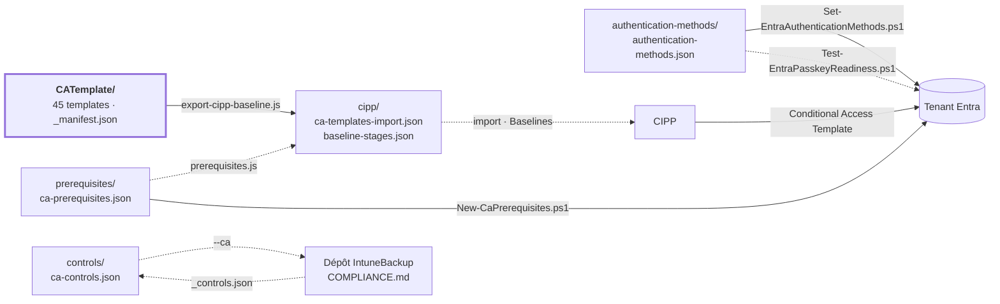

[Nederlands](STRUCTUUR.md) · [English](STRUCTUUR.en.md) · **Français**

# Structure et liaisons

Comment ce dépôt est organisé et à quoi il est relié : quelle est la source, ce qui en est généré,
quels systèmes le lisent et comment il arrive dans un tenant. Pour le *pourquoi* par template :
[ANALYSE.fr.md](ANALYSE.fr.md).

## En bref

- **Une seule source :** `CATemplate/` — 45 stratégies Conditional Access au format de template
  CIPP : 18 BLOCK, 16 GRANT, 7 SESSION.
- **Un seul dérivé :** `cipp/` — les templates sous forme de fichier d'import et la répartition en
  trois stages pour une baseline CIPP.
- **Trois dossiers à côté** avec ce dont une stratégie CA a besoin sans en faire elle-même partie :
  les prérequis dans le tenant, l'authentication methods policy et le mapping de normes.
- **Deux voies vers le tenant :** CIPP déploie les stratégies ; les prérequis et les méthodes
  d'authentification passent par nos propres scripts PowerShell via Microsoft Graph.
- **Un dépôt frère :** le dépôt IntuneBackup, cloné à côté de celui-ci sous `../IntuneBackup`, lit
  `controls/ca-controls.json` pour son `COMPLIANCE.md` et `docs/policies.json` pour le lien retour
  sur chaque stratégie Intune, et fournit le vocabulaire des libellés de normes.
- **Rien de ce qui est généré n'est modifié à la main.** Un workflow GitHub régénère `cipp/` après
  chaque modification et ouvre une PR pour cela.

## Vue d'ensemble

Les flèches pleines écrivent ; les pointillés ne font que lire.

## Dossiers

| Dossier | Contenu | Créé par | Repris par |
|---|---|---|---|
| [`CATemplate/`](../CATemplate/README.fr.md) | Les stratégies, un `CA__<numéro>__<BLOCK\|GRANT\|SESSION>__<Nom>.json` par stratégie, plus `_manifest.json` | main (export depuis CIPP) | tous les scripts, `generate-compliance.js` d'IntuneBackup |
| [`cipp/`](../cipp/README.fr.md) | Fichier d'import et répartition en stages pour une baseline CIPP | `export-cipp-baseline.js` | CIPP (import manuel) |
| [`prerequisites/`](../prerequisites/README.fr.md) | Groupes, named locations, custom authentication strengths et authentication contexts auxquels les templates font référence | main | `prerequisites.js`, `export-cipp-baseline.js`, `New-CaPrerequisites.ps1` |
| [`authentication-methods/`](../authentication-methods/README.fr.md) | État souhaité de l'authentication methods policy, avec les profils passkey | main | `authentication-methods.js`, les deux scripts Entra |
| [`controls/`](../controls/README.fr.md) | Mapping de normes par template (ISO 27001, NIS2, CIS, NIST CSF) | main | `check-controls.js`, `generate-compliance.js` d'IntuneBackup |
| `docs/` | Documentation : cette structure et l'analyse, plus `policies.json` — par template l'objectif, les pièges et les dépendances Intune | main | lecteurs ; `policies.json` par `generate-docs.js` ici et là-bas |
| [`scripts/`](../scripts/README.fr.md) | Validation, export, scripts de tenant, miroir | main | workflow GitHub |
| `local/` | Copies de travail avec valeurs propres au tenant | main | **pas dans git** (`.gitignore`) |

## Les fichiers qui pilotent tout

| Fichier | Détermine | Lu par |
|---|---|---|
| `state` (champ de chaque template) | Stage 1 (`enabled`) ou stage 2 (`disabled`, report-only) ; aussi la phase dans COMPLIANCE.md | `export-cipp-baseline.js`, `authentication-methods.js`, `generate-compliance.js` d'IntuneBackup |
| `CATemplate/_manifest.json` | Quels templates sont optionnels (stage 3), avec la raison | `export-cipp-baseline.js` |
| `CATemplate/_organisation.json` | Le préfixe des stratégies (`CA - `, nom de fichier `CA__`) et les propres tenants fournisseurs de services (générique une liste vide ; avec des id, chaque stratégie utilisateurs exclut les techniciens GDAP de ces tenants) | tous les scripts via `scripts/lib/organisation.js` ; à changer avec `set-organisation.js` |
| `prerequisites/ca-prerequisites.json` | Ce qui doit exister dans le tenant avant le déploiement, et à quel point c'est dangereux si cela manque | `prerequisites.js`, `export-cipp-baseline.js`, `New-CaPrerequisites.ps1` |
| `controls/ca-controls.json` | Quels libellés de normes chaque template couvre | `check-controls.js`, `generate-docs.js`, `generate-compliance.js` d'IntuneBackup |
| `docs/policies.json` | Ce que fait chaque template, les points d'attention, et de quelles stratégies Intune il dépend | `generate-docs.js`, `generate-docs.js` d'IntuneBackup |
| `authentication-methods/authentication-methods.json` | Quelles méthodes d'authentification sont activées ou désactivées, dans quel ordre, et les profils passkey | `authentication-methods.js`, `Set-EntraAuthenticationMethods.ps1`, `Test-EntraPasskeyReadiness.ps1` |

`_manifest.json` se trouve dans `CATemplate/` comme les fichiers `_` dans `IntuneTemplate/`
d'IntuneBackup : à côté des templates qu'il décrit. Les scripts ne lisent que `CA__*.json` comme
template, et pour CIPP c'est un `.json` sans `displayName` — aucune stratégie n'en sort (voir
[ci-dessous](#ce-que-cipp-fait-de-ce-dépôt)).

## Stages

`export-cipp-baseline.js` affecte chaque template à un seul stage ; les critères figurent une seule
fois, dans `STAGE_PLAN` dans ce script.

| Stage | Critère | Templates | Déployé comme | Action |
|---:|---|---:|---|---|
| 1 — Socle | `state: enabled`, non optionnel | 17 | `enabled` | Report ; Remediate avec `--remediate-stage1` |
| 2 — Renforcement | `disabled` ou report-only dans le template | 12 | report-only | Report |
| 3 — Choix du tenant et licence | `optional: true` dans `_manifest.json` | 12 | report-only | Report |

Trois templates restent fixés sur Report jusqu'à ce que leur prérequis soit en place dans le
tenant : `1040` (pays), `1060` (plages IP) et `1180` (Global Secure Access).

## Scripts et ordre d'exécution

| Étape | Script | Lit | Écrit |
|---:|---|---|---|
| 1 | `prerequisites.js` | `CATemplate/`, `prerequisites/`, `authentication-methods/` | rien — échoue en cas d'erreur |
| 2 | `check-controls.js` | `CATemplate/`, `controls/`, `../IntuneBackup/` (ou `../CIPP-Templates-Intune/`) `IntuneTemplate/_controls.json` s'il existe | rien — échoue en cas d'erreur |
| 3 | `authentication-methods.js` | `authentication-methods/`, `CATemplate/` | rien — échoue en cas d'erreur |
| 4 | `export-cipp-baseline.js` | `CATemplate/`, `_manifest.json`, `prerequisites/`, le `cipp/baseline-stages.json` précédent | `cipp/` |
| 5 | `generate-docs.js` | `CATemplate/`, `_manifest.json`, `cipp/baseline-stages.json`, `docs/policies.json`, `controls/ca-controls.json` ; les chemins Intune contre `../IntuneBackup/` s'il est présent | `CATemplate/README*.md` et un README par stratégie |
| 6 | `node --test scripts/*.test.js` | tout ce qui précède, plus `cipp/` | rien — échoue en cas d'erreur |
| – | `New-CaPrerequisites.ps1` | `prerequisites/` | groupes, emplacements et strengths dans le tenant |
| – | `Set-EntraAuthenticationMethods.ps1` | `authentication-methods/` | l'authentication methods policy dans le tenant (avec `-Apply`) |
| – | `Test-EntraPasskeyReadiness.ps1` | `authentication-methods/` | rien — un rapport uniquement |
| – | `set-organisation.js` | `CATemplate/_organisation.json`, tous les fichiers texte | un autre préfixe dans le texte et les noms de fichiers, puis `cipp/` et les docs |
| – | `sync-mirror.js` | `git ls-files` | un second clone |

Les étapes 1 à 6 sont exécutées par [`.github/workflows/generate-cipp.yml`](../.github/workflows/generate-cipp.yml)
après chaque modification. Détails : [scripts/README.fr.md](../scripts/README.fr.md).

## Liaisons externes

| Système | Sens | Comment | Attention |
|---|---|---|---|
| Dépôt IntuneBackup (`../IntuneBackup`, miroir `../CIPP-Templates-Intune`) | CA → Intune | `generate-compliance.js --ca ../CA-Policies/controls/ca-controls.json` là-bas | Git y contient la version `--no-ca` ; la CI ne voit pas ce dépôt |
| Dépôt IntuneBackup (`../IntuneBackup`, miroir `../CIPP-Templates-Intune`) | Intune → CA | `check-controls.js` lit `IntuneTemplate/_controls.json` | Uniquement en local ; en CI, il saute le contrôle des libellés |
| Dépôt IntuneBackup | CA ↔ Intune par stratégie | `generate-docs.js` ici renvoie vers les stratégies Intune ; `generate-docs.js` là-bas lit `docs/policies.json` et indique sur chaque stratégie Intune quelles stratégies CA s'y appuient | Les liens pointent vers le miroir sur GitHub (ConXioN-ITCE). Une copie y est conservée dans `IntuneTemplate/_ca.json`, pour la CI sans ce dépôt |
| CIPP | dépôt → CIPP | importer `cipp/ca-templates-import.json`, construire la baseline selon `cipp/baseline-stages.json` | La baseline dans CIPP est une copie mise à jour à la main |
| Microsoft Graph | dépôt → tenant | `New-CaPrerequisites.ps1`, `Set-EntraAuthenticationMethods.ps1` | d'abord `-WhatIf` ; l'id d'une custom strength à reporter à la main dans le déploiement CIPP |
| GitHub Actions | dépôt → dépôt | `generate-cipp.yml` ouvre une PR | le seul workflow |
| Clone miroir | dépôt → miroir | `sync-mirror.js <doelmap> --push` | historique propre de ce côté, pas de force push ; à lancer après le pipeline. Le miroir garde son propre préfixe (`set-organisation.js` là-bas) |

### Ce que CIPP fait de ce dépôt

- **Si le dépôt est relié dans CIPP comme dépôt de templates,** la synchronisation récupère chaque
  `.json` (sauf les chemins contenant `NativeImport`). Les templates de `CATemplate/` deviennent
  alors des templates Conditional Access.
- **Tout autre `.json` sans `displayName`** — `_manifest.json`, `prerequisites/`, `controls/`,
  `authentication-methods/`, `docs/policies.json` — devient au plus une ligne de template sans nom. Elle ne fait rien et
  peut être supprimée dans CIPP ; c'est le même arbitrage que pour les fichiers `_` dans
  `IntuneTemplate/` d'IntuneBackup.

## Conventions

- **Nommage :** `CA - <nummer> - <BLOCK|GRANT|SESSION> - <Omschrijving>` dans le tenant,
  `CA__<nummer>__<TYPE>__<Naam>.json` comme fichier. Les clés dans `_manifest.json` et
  `ca-controls.json` sont ce nom de fichier sans `.json`.
- **Les GUID restent identiques** : le GUID identifie la ligne de template CIPP ; un nouveau GUID
  produit un second template portant le même nom.
- **Rien de propre au tenant dans un template.** Les pays, les plages IP et l'id d'une custom
  authentication strength arrivent par tenant via `New-CaPrerequisites.ps1` ; l'export retire ce qui
  s'y trouverait malgré tout, et les tests échouent dessus.
- **Report sauf si quelqu'un décide.** Ce qui est dans git est entièrement sur Report ; Remediate est
  une décision par tenant, après `New-CaPrerequisites.ps1`.
- **Généré, ne pas modifier à la main :** `cipp/`.

## Pour aller plus loin

| Document | Pour |
|---|---|
| [README.fr.md](../README.fr.md) | Explication complète : ajout, déploiement, prérequis, normes |
| [ANALYSE.fr.md](ANALYSE.fr.md) | Pourquoi certaines choses sont ou ne sont pas dans l'ensemble |
| [scripts/README.fr.md](../scripts/README.fr.md) | Chaque script, et l'ordre d'exécution |
| [CATemplate/README.fr.md](../CATemplate/README.fr.md) | Chaque stratégie : pour qui, quoi, state et stage, avec un lien vers le README par stratégie (généré) |
| [prerequisites/README.fr.md](../prerequisites/README.fr.md) | Groupes, emplacements et strengths dont un tenant a besoin |
| [controls/README.fr.md](../controls/README.fr.md) | Le mapping de normes et sa destination |
| [cipp/README.fr.md](../cipp/README.fr.md) | Les fichiers de déploiement et les stages |
| [authentication-methods/README.fr.md](../authentication-methods/README.fr.md) | Méthodes d'authentification et passkeys |
