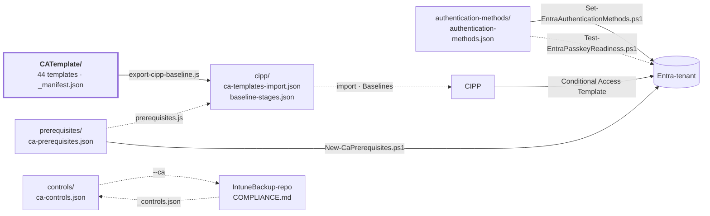

**Nederlands** · [English](STRUCTUUR.en.md) · [Français](STRUCTUUR.fr.md)

# Structuur en koppelingen

Hoe deze repo in elkaar zit en waar hij aan vastzit: wat de bron is, wat eruit wordt
gegenereerd, welke systemen het lezen en hoe het in een tenant belandt. Voor het *waarom* per
template: [ANALYSE.md](ANALYSE.md).

## In het kort

- **Eén bron:** `CATemplate/` — 44 Conditional Access-policies in CIPP-templateformaat:
  18 BLOCK, 16 GRANT, 7 SESSION.
- **Eén afgeleide:** `cipp/` — de templates als importbestand en de indeling in drie stages voor
  een CIPP-baseline.
- **Drie mappen ernaast** met wat een CA-policy nodig heeft maar zelf niet is: de
  randvoorwaarden in de tenant, het authentication methods policy en de normenmapping.
- **Twee wegen naar de tenant:** CIPP rolt de policies uit; de randvoorwaarden en de
  aanmeldmethodes gaan met eigen PowerShell-scripts via Microsoft Graph.
- **Eén zusterrepo:** de IntuneBackup-repo, naast deze gekloond als `../IntuneBackup`, leest
  `controls/ca-controls.json` voor zijn `COMPLIANCE.md` en `docs/policies.json` voor de
  terugkoppeling bij elke Intune-policy, en levert de vocabulaire van de normlabels.
- **Alles wat gegenereerd is, wordt niet met de hand bewerkt.** Een GitHub-workflow regenereert
  `cipp/` na elke wijziging en opent daar een PR voor.

## Samenhang

Doorgetrokken pijlen schrijven; stippellijnen lezen alleen.

## Mappen

| Map | Wat erin staat | Gemaakt door | Opgepikt door |
|---|---|---|---|
| [`CATemplate/`](../CATemplate/README.md) | De policies, één `CA__<nummer>__<BLOCK\|GRANT\|SESSION>__<Naam>.json` per stuk, plus `_manifest.json` | hand (export uit CIPP) | alle scripts, IntuneBackup's `generate-compliance.js` |
| [`cipp/`](../cipp/README.md) | Importbestand en stage-indeling voor een CIPP-baseline | `export-cipp-baseline.js` | CIPP (handmatige import) |
| [`prerequisites/`](../prerequisites/README.md) | Groepen, named locations, custom authentication strengths en authentication contexts waar templates naar verwijzen | hand | `prerequisites.js`, `export-cipp-baseline.js`, `New-CaPrerequisites.ps1` |
| [`authentication-methods/`](../authentication-methods/README.md) | Gewenste stand van het authentication methods policy, met passkey-profielen | hand | `authentication-methods.js`, de twee Entra-scripts |
| [`controls/`](../controls/README.md) | Normenmapping per template (ISO 27001, NIS2, CIS, NIST CSF) | hand | `check-controls.js`, IntuneBackup's `generate-compliance.js` |
| `docs/` | Documentatie: deze structuur en de analyse, plus `policies.json` — per template het doel, de valkuilen en de Intune-afhankelijkheden | hand | lezers; `policies.json` door `generate-docs.js` hier en daar |
| [`scripts/`](../scripts/README.md) | Validatie, export, tenantscripts, spiegel | hand | GitHub-workflow |
| `local/` | Werkkopieën met tenant-specifieke waarden | hand | **niet in git** (`.gitignore`) |

## De bestanden die alles sturen

| Bestand | Bepaalt | Gelezen door |
|---|---|---|
| `state` (veld in elk template) | Stage 1 (`enabled`) of stage 2 (`disabled`, report-only); ook de fase in COMPLIANCE.md | `export-cipp-baseline.js`, `authentication-methods.js`, IntuneBackup's `generate-compliance.js` |
| `CATemplate/_manifest.json` | Welke templates optioneel zijn (stage 3), met de reden | `export-cipp-baseline.js` |
| `CATemplate/_organisation.json` | Het voorvoegsel van de policies (`CA - `, bestandsnaam `CA__`) en de eigen service provider-tenant (generiek `null`; met een id sluit elke gebruikerspolicy de GDAP-technici van die tenant uit) | alle scripts via `scripts/lib/organisation.js`; wijzigen met `set-organisation.js` |
| `prerequisites/ca-prerequisites.json` | Wat er in de tenant moet bestaan vóór de uitrol, en hoe gevaarlijk het is als het ontbreekt | `prerequisites.js`, `export-cipp-baseline.js`, `New-CaPrerequisites.ps1` |
| `controls/ca-controls.json` | Welke normlabels elk template invult | `check-controls.js`, `generate-docs.js`, IntuneBackup's `generate-compliance.js` |
| `docs/policies.json` | Wat elk template doet, waar je op let, en van welke Intune-policies hij afhangt | `generate-docs.js`, IntuneBackup's `generate-docs.js` |
| `authentication-methods/authentication-methods.json` | Welke aanmeldmethodes aan of uit staan, in welke volgorde, en de passkey-profielen | `authentication-methods.js`, `Set-EntraAuthenticationMethods.ps1`, `Test-EntraPasskeyReadiness.ps1` |

`_manifest.json` staat in `CATemplate/` zoals de `_`-bestanden in IntuneBackup's
`IntuneTemplate/`: naast de templates die hij beschrijft. De scripts lezen alleen
`CA__*.json` als template, en voor CIPP is het een `.json` zonder `displayName` — daar komt
geen policy uit (zie [hieronder](#wat-cipp-met-deze-repo-doet)).

## Stages

`export-cipp-baseline.js` deelt elk template in één stage in; de criteria staan één keer, in
`STAGE_PLAN` in dat script.

| Stage | Criterium | Templates | Uitgerold als | Actie |
|---:|---|---:|---|---|
| 1 — Kern | `state: enabled`, niet optioneel | 17 | `enabled` | Report; Remediate met `--remediate-stage1` |
| 2 — Aanscherping | `disabled` of report-only in het template | 12 | report-only | Report |
| 3 — Tenantkeuze en licentie | `optional: true` in `_manifest.json` | 12 | report-only | Report |

Drie templates staan vast op Report tot hun randvoorwaarde in de tenant staat: `1040` (landen),
`1060` (IP-ranges) en `1180` (Global Secure Access).

## Scripts en volgorde

| Stap | Script | Leest | Schrijft |
|---:|---|---|---|
| 1 | `prerequisites.js` | `CATemplate/`, `prerequisites/`, `authentication-methods/` | niets — faalt bij fouten |
| 2 | `check-controls.js` | `CATemplate/`, `controls/`, `../IntuneBackup/` (of `../CIPP-Templates-Intune/`) `IntuneTemplate/_controls.json` als die er is | niets — faalt bij fouten |
| 3 | `authentication-methods.js` | `authentication-methods/`, `CATemplate/` | niets — faalt bij fouten |
| 4 | `export-cipp-baseline.js` | `CATemplate/`, `_manifest.json`, `prerequisites/`, de vorige `cipp/baseline-stages.json` | `cipp/` |
| 5 | `generate-docs.js` | `CATemplate/`, `_manifest.json`, `cipp/baseline-stages.json`, `docs/policies.json`, `controls/ca-controls.json`; de Intune-paden tegen `../IntuneBackup/` als die er is | `CATemplate/README*.md` en een README per policy |
| 6 | `node --test scripts/*.test.js` | alles hierboven, plus `cipp/` | niets — faalt bij fouten |
| – | `New-CaPrerequisites.ps1` | `prerequisites/` | groepen, locaties en strengths in de tenant |
| – | `Set-EntraAuthenticationMethods.ps1` | `authentication-methods/` | het authentication methods policy in de tenant (met `-Apply`) |
| – | `Test-EntraPasskeyReadiness.ps1` | `authentication-methods/` | niets — alleen een rapport |
| – | `set-organisation.js` | `CATemplate/_organisation.json`, alle tekstbestanden | ander voorvoegsel in tekst en bestandsnamen, daarna `cipp/` en de docs |
| – | `sync-mirror.js` | `git ls-files` | een tweede clone |

Stap 1 t/m 6 draait [`.github/workflows/generate-cipp.yml`](../.github/workflows/generate-cipp.yml)
na elke wijziging. Details: [scripts/README.md](../scripts/README.md).

## Externe koppelingen

| Systeem | Richting | Hoe | Let op |
|---|---|---|---|
| IntuneBackup-repo (`../IntuneBackup`, spiegel `../CIPP-Templates-Intune`) | CA → Intune | `generate-compliance.js --ca ../CA-Policies/controls/ca-controls.json` daar | Git bevat daar de `--no-ca`-versie; CI ziet deze repo niet |
| IntuneBackup-repo (`../IntuneBackup`, spiegel `../CIPP-Templates-Intune`) | Intune → CA | `check-controls.js` leest `IntuneTemplate/_controls.json` | Alleen lokaal; in CI slaat hij de labelcontrole over |
| IntuneBackup-repo | CA ↔ Intune per policy | `generate-docs.js` hier linkt naar de Intune-policies; `generate-docs.js` daar leest `docs/policies.json` en zet bij elke Intune-policy welke CA-policies erop leunen | Links gaan naar de spiegel op GitHub (ConXioN-ITCE). Daar staat een kopie in `IntuneTemplate/_ca.json`, voor CI zonder deze repo |
| CIPP | repo → CIPP | `cipp/ca-templates-import.json` importeren, de baseline opbouwen volgens `cipp/baseline-stages.json` | De baseline in CIPP is een kopie die met de hand wordt bijgewerkt |
| Microsoft Graph | repo → tenant | `New-CaPrerequisites.ps1`, `Set-EntraAuthenticationMethods.ps1` | eerst `-WhatIf`; het id van een custom strength met de hand in de CIPP-uitrol |
| GitHub Actions | repo → repo | `generate-cipp.yml` opent een PR | de enige workflow |
| Spiegelclone | repo → spiegel | `sync-mirror.js <doelmap> --push` | eigen geschiedenis aan die kant, geen force-push; draai het ná de pijplijn. De spiegel houdt zijn eigen voorvoegsel (`set-organisation.js` daar) |

### Wat CIPP met deze repo doet

- **Is de repo in CIPP als template-repository gekoppeld,** dan haalt de sync elk `.json` op
  (behalve paden met `NativeImport`). De templates in `CATemplate/` worden dan Conditional
  Access-templates.
- **Elk ander `.json` zonder `displayName`** — `_manifest.json`, `prerequisites/`, `controls/`,
  `authentication-methods/`, `docs/policies.json` — wordt hooguit één naamloze templaterij. Die doet niets en mag in
  CIPP weg; dat is dezelfde afweging als bij de `_`-bestanden in IntuneBackup's
  `IntuneTemplate/`.

## Afspraken

- **Naamgeving:** `CA - <nummer> - <BLOCK|GRANT|SESSION> - <Omschrijving>` in de tenant,
  `CA__<nummer>__<TYPE>__<Naam>.json` als bestand. De sleutels in `_manifest.json` en
  `ca-controls.json` zijn die bestandsnaam zonder `.json`.
- **GUID's blijven gelijk**: de GUID identificeert de CIPP-templaterij; een nieuwe GUID levert
  een tweede template met dezelfde naam op.
- **Niets tenant-specifieks in een template.** Landen, IP-ranges en het id van een custom
  authentication strength komen per tenant binnen via `New-CaPrerequisites.ps1`; de export haalt
  wat er toch in staat eruit, en de tests falen erop.
- **Report tenzij iemand beslist.** Wat in git staat is volledig Report; Remediate is een
  besluit per tenant, ná `New-CaPrerequisites.ps1`.
- **Gegenereerd, niet met de hand bewerken:** `cipp/`.

## Verder lezen

| Document | Voor |
|---|---|
| [README.md](../README.md) | Volledige uitleg: toevoegen, uitrollen, randvoorwaarden, normen |
| [ANALYSE.md](ANALYSE.md) | Waarom wat wel en niet in de set zit |
| [scripts/README.md](../scripts/README.md) | Elk script, en de volgorde |
| [CATemplate/README.md](../CATemplate/README.md) | Elke policy: voor wie, wat, state en stage, met een link naar de README per policy (gegenereerd) |
| [prerequisites/README.md](../prerequisites/README.md) | Groepen, locaties en strengths die een tenant nodig heeft |
| [controls/README.md](../controls/README.md) | De normenmapping en waar hij naartoe gaat |
| [cipp/README.md](../cipp/README.md) | De uitrolbestanden en de stages |
| [authentication-methods/README.md](../authentication-methods/README.md) | Aanmeldmethodes en passkeys |
