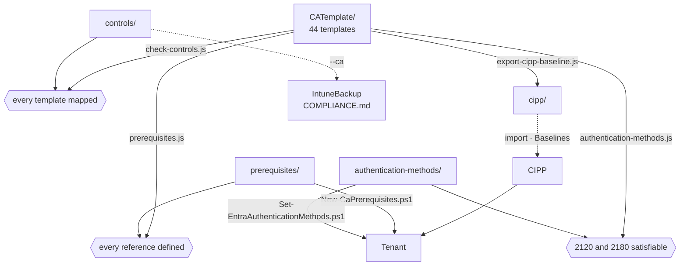

[Nederlands](README.md) · **English** · [Français](README.fr.md)

# scripts/

`CATemplate/` is the only source. Everything here checks that folder and what is attached to it,
derives the CIPP export from it, or puts the prerequisites into a tenant — nothing writes to
`cipp/` without `CATemplate/` already knowing it.



## Node

| Script | Direction | What it does |
|---|---|---|
| [`prerequisites.js`](prerequisites.js) | check | Every group, named location, custom authentication strength and authentication context that a template refers to has a definition in `prerequisites/ca-prerequisites.json`; named locations have the same content in template and definition; no template carries a real strength id. Blocking in CI, and `export-cipp-baseline.js` also calls it itself. |
| [`check-controls.js`](check-controls.js) | check | Every template has a standards mapping in `controls/ca-controls.json`, and no mapping names a template that does not exist. If the IntuneBackup repo is next to this one (`../IntuneBackup`), it also checks the labels against `IntuneTemplate/_controls.json`. Blocking in CI. |
| [`authentication-methods.js`](authentication-methods.js) | check | `authentication-methods/authentication-methods.json` does not contradict itself, and `2120` and `2180` do not demand a method that is disabled. Blocking in CI. |
| [`export-cipp-baseline.js`](export-cipp-baseline.js) | **out of** the source | Writes `cipp/ca-templates-import.json` (the templates, without tenant-specific values) and `cipp/baseline-stages.json` (stage, state and action per template). Reads `CATemplate/_manifest.json` for the optional templates. Everything on Report; `--remediate-stage1` sets stage 1 to Remediate, and refuses as long as there are templates new in stage 1 compared to the previous export — `--accept-new` confirms them. |
| [`generate-docs.js`](generate-docs.js) | **from** the source | Writes `CATemplate/README.md` (and `.en`, `.fr`): every policy with who, what, state and stage, and per policy its own README with the purpose, the conditions, the pitfalls, the standards and the Intune policies it depends on (from `docs/policies.json`). With the IntuneBackup repo next to it, it also checks that those Intune paths exist and that every compliance policy is in a group. Runs after the export, because the stage comes from `cipp/baseline-stages.json`. `--check` writes nothing and fails if a README is out of date; a test does the same. |
| [`sync-mirror.js`](sync-mirror.js) | mirror | Brings a second clone in line with what is in git here — see [below](#mirroring-to-a-second-clone). |
| [`set-organisation.js`](set-organisation.js) | organisation | Puts the repo on a different prefix (`CATemplate/_organisation.json`): text, file names, then `cipp/` and the docs. |

Every check script has a `*.test.js` next to it; `node --test scripts/*.test.js` runs them
all. The tests also guard what the scripts themselves do not see: that the export in git is entirely on
Report, that no IP range leaks into the import files, and that every key in
`_manifest.json` is an existing template.

## PowerShell

All three require PowerShell 7 (`pwsh`) and the Microsoft Graph modules from their
`#Requires` line. Run them with `-WhatIf` first (or without `-Apply`).

| Script | What it does |
|---|---|
| [`New-CaPrerequisites.ps1`](New-CaPrerequisites.ps1) | Creates the groups, named locations, custom authentication strengths and authentication contexts from `prerequisites/` in a tenant. Idempotent. `-AllowedCountry` and `-ServiceAccountIpRange` for the two tenant-specific locations, `-BreakGlassUserId` for the break-glass groups, `-RequireSafeToDeploy` to abort as long as the critical groups are empty. Reports the id of a created custom strength, which has to go into the CIPP deployment by hand. |
| [`Set-EntraAuthenticationMethods.ps1`](Set-EntraAuthenticationMethods.ps1) | Compares a tenant's authentication methods policy with `authentication-methods/`; with `-Apply` it sets the differences. `-CheckRegistrationFirst` refuses to disable a method as long as there are users without an MFA method. Passkey profiles it only reports. |
| [`Test-EntraPasskeyReadiness.ps1`](Test-EntraPasskeyReadiness.ps1) | Tells before deployment, per user, whether they *can* register a passkey, and if not: why. Read-only. `-Scenario WindowsHelloPasskey \| SecurityKey \| WindowsHelloForBusiness`. |

## Order

```bash
node scripts/prerequisites.js            # first: does every template refer to something that exists?
node scripts/check-controls.js           # does every template have a standards mapping?
node scripts/authentication-methods.js   # do the sign-in methods not contradict the templates?
node scripts/export-cipp-baseline.js     # then: regenerate cipp/
node scripts/generate-docs.js            # CATemplate/README and the README per policy
node --test scripts/*.test.js            # last, because part of it looks at cipp/
```

That order is also in [`.github/workflows/generate-cipp.yml`](../.github/workflows/generate-cipp.yml),
which opens a PR with the regenerated `cipp/` after every change. On a pull request it runs
the same steps without opening a PR.

In a tenant, *after* a green pipeline:

```powershell
./scripts/New-CaPrerequisites.ps1 -TenantId <tenant> -WhatIf
./scripts/New-CaPrerequisites.ps1 -TenantId <tenant> -AllowedCountry 'NL','BE' -ServiceAccountIpRange '<cidr>' -BreakGlassUserId '<object-id>' -RequireSafeToDeploy
./scripts/Set-EntraAuthenticationMethods.ps1 -TenantId <tenant>
```

Only then the baseline in CIPP, and only when `New-CaPrerequisites.ps1` exits green, stage 1 to
Remediate.

## The CA side of COMPLIANCE.md

`controls/ca-controls.json` feeds `COMPLIANCE.md` in the IntuneBackup repo. If that repo is cloned
next to this one as `../IntuneBackup`:

```bash
cd ../IntuneBackup
node scripts/generate-compliance.js --strict --ca ../CA-Policies/controls/ca-controls.json
```

That script reads, for each key in `ca-controls.json`, the matching template in `CATemplate/`,
for its `state`. Renaming a template without taking the key along breaks that link;
`check-controls.js` catches that here.

## Three languages

Every document exists in Dutch (`X.md`), English (`X.en.md`) and French (`X.fr.md`), with
a language bar at the top. Dutch is the source; a change in `X.md` belongs in the same commit
in `X.en.md` and `X.fr.md` too. Scripts, their help text and the workflow are in English; the output of
the Node scripts and the explanations in the data (`purpose`, `reden`, `_comment`) remain
Dutch. What ends up in the tenant — the description of a group or an authentication
strength — is English.

## Mirroring to a second clone

`sync-mirror.js` is not part of the pipeline above. It brings the files in a second clone
in line with what is in git here and makes one ordinary commit of it there.

The mirror keeps its own prefix: if its `CATemplate/_organisation.json` has a different `prefix`
than here, `set-organisation.js` runs there after copying. So everything here carries
the prefix `CA - ` and in the mirror for instance `CXNM - STANDARD - `. If the target clone has
no `_organisation.json` yet, the script refuses until you pass the prefix once:
`--prefix "CXNM - STANDARD - "`. After that it is fixed there.

```bash
node scripts/sync-mirror.js <target-dir> --dry-run   # first see what would shift
node scripts/sync-mirror.js <target-dir> --push
```

What goes along is `git ls-files`, not what is on disk — that keeps `local/` out of the
mirror, and that is exactly the reason not to do it with a copy command: a working copy with
tenant-specific values that leaks to a second remote can never be got out of there again.
Deleted is deleted, but only for files that are in git on the other side; what was
created locally there is left alone.

The target clone keeps its own history. No `push --force`, so the commits, workflow runs and
branches on that side stay — and that is also why it is a script and not a remote: a
second remote of this repo would overwrite that side on every push.

Run it *after* the order above, otherwise you mirror a `cipp/` that is still lagging behind.
