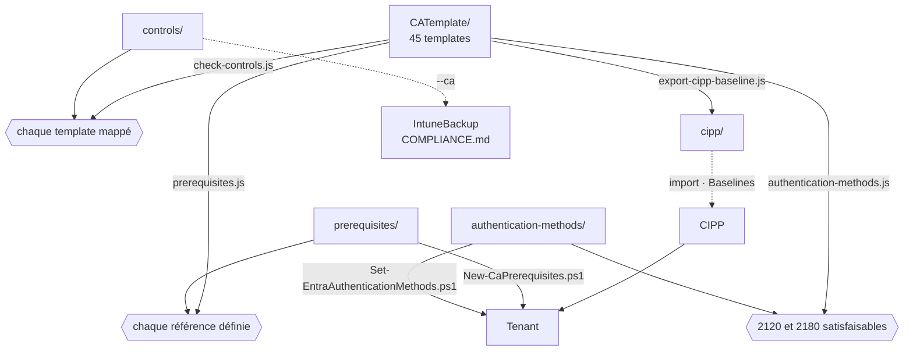

[Nederlands](README.md) · [English](README.en.md) · **Français**

# scripts/

`CATemplate/` est la seule source. Tout ce qui se trouve ici contrôle ce dossier et ce qui y est
relié, en dérive l'export CIPP, ou met en place les prérequis dans un tenant — rien n'écrit dans
`cipp/` sans que `CATemplate/` le sache déjà.



## Node

| Script | Sens | Ce qu'il fait |
|---|---|---|
| [`prerequisites.js`](prerequisites.js) | contrôle | Chaque groupe, named location, custom authentication strength et authentication context auquel un template fait référence a une définition dans `prerequisites/ca-prerequisites.json` ; les named locations ont le même contenu dans le template et dans la définition ; aucun template ne porte un vrai id de strength. Bloquant en CI, et `export-cipp-baseline.js` l'appelle lui-même aussi. |
| [`check-controls.js`](check-controls.js) | contrôle | Chaque template a un mapping de normes dans `controls/ca-controls.json`, et aucun mapping ne cite un template qui n'existe pas. Si le dépôt IntuneBackup est à côté (`../IntuneBackup`), il vérifie aussi les libellés par rapport à `IntuneTemplate/_controls.json`. Bloquant en CI. |
| [`authentication-methods.js`](authentication-methods.js) | contrôle | `authentication-methods/authentication-methods.json` ne se contredit pas, et `2120` et `2180` n'exigent aucune méthode désactivée. Bloquant en CI. |
| [`export-cipp-baseline.js`](export-cipp-baseline.js) | **depuis** la source | Écrit `cipp/ca-templates-import.json` (les templates, sans valeurs propres au tenant) et `cipp/baseline-stages.json` (stage, state et action par template). Lit `CATemplate/_manifest.json` pour les templates optionnels. Tout sur Report ; `--remediate-stage1` met le stage 1 sur Remediate, et refuse tant que des templates sont nouveaux au stage 1 par rapport à l'export précédent — `--accept-new` les confirme. |
| [`generate-docs.js`](generate-docs.js) | **depuis** la source | Écrit `CATemplate/README.md` (et `.en`, `.fr`) : chaque stratégie avec pour qui, quoi, state et stage, et par stratégie son propre README avec l'objectif, les conditions, les pièges, les normes et les stratégies Intune dont elle dépend (depuis `docs/policies.json`). Avec le dépôt IntuneBackup à côté, il vérifie aussi que ces chemins Intune existent et que chaque stratégie de conformité figure dans un groupe. S'exécute après l'export, car le stage vient de `cipp/baseline-stages.json`. `--check` n'écrit rien et échoue si un README est périmé ; un test fait de même. |
| [`sync-mirror.js`](sync-mirror.js) | miroir | Aligne un second clone sur ce qui est dans git ici — voir [ci-dessous](#mise-en-miroir-vers-un-second-clone). |
| [`set-organisation.js`](set-organisation.js) | organisation | Passe le dépôt sur un autre préfixe (`CATemplate/_organisation.json`) : texte, noms de fichiers, puis `cipp/` et les docs. |

Chaque script de contrôle a un `*.test.js` à côté de lui ; `node --test scripts/*.test.js` les exécute
tous. Les tests surveillent aussi ce que les scripts eux-mêmes ne voient pas : que l'export dans git
est entièrement sur Report, qu'aucune plage IP ne fuit dans les fichiers d'import, et que chaque clé
de `_manifest.json` est un template existant.

## PowerShell

Les trois nécessitent PowerShell 7 (`pwsh`) et les modules Microsoft Graph de leur ligne
`#Requires`. Exécutez-les d'abord avec `-WhatIf` (ou sans `-Apply`).

| Script | Ce qu'il fait |
|---|---|
| [`New-CaPrerequisites.ps1`](New-CaPrerequisites.ps1) | Crée dans un tenant les groupes, named locations, custom authentication strengths et authentication contexts de `prerequisites/`. Idempotent. `-AllowedCountry` et `-ServiceAccountIpRange` pour les deux emplacements propres au tenant, `-BreakGlassUserId` pour les groupes break-glass, `-RequireSafeToDeploy` pour interrompre tant que les groupes critiques sont vides. Indique l'id d'une custom strength créée, qui doit être reporté à la main dans le déploiement CIPP. |
| [`Set-EntraAuthenticationMethods.ps1`](Set-EntraAuthenticationMethods.ps1) | Compare l'authentication methods policy d'un tenant avec `authentication-methods/` ; avec `-Apply`, il applique les écarts. `-CheckRegistrationFirst` refuse de désactiver une méthode tant qu'il y a des utilisateurs sans méthode MFA. Il se contente de signaler les profils passkey. |
| [`Test-EntraPasskeyReadiness.ps1`](Test-EntraPasskeyReadiness.ps1) | Indique avant le déploiement, par utilisateur, s'il *peut* enregistrer une passkey, et sinon : pourquoi. Lecture seule. `-Scenario WindowsHelloPasskey \| SecurityKey \| WindowsHelloForBusiness`. |

## Ordre d'exécution

```bash
node scripts/prerequisites.js            # d'abord : chaque template fait-il référence à quelque chose qui existe ?
node scripts/check-controls.js           # chaque template a-t-il un mapping de normes ?
node scripts/authentication-methods.js   # les méthodes d'authentification ne contredisent-elles pas les templates ?
node scripts/export-cipp-baseline.js     # puis : régénérer cipp/
node scripts/generate-docs.js            # CATemplate/README et le README par stratégie
node --test scripts/*.test.js            # en dernier, car une partie examine cipp/
```

Cet ordre figure aussi dans [`.github/workflows/generate-cipp.yml`](../.github/workflows/generate-cipp.yml),
qui ouvre après chaque modification une PR avec le `cipp/` régénéré. Sur une pull request, il exécute
les mêmes étapes sans ouvrir de PR.

Dans un tenant, après un pipeline vert :

```powershell
./scripts/New-CaPrerequisites.ps1 -TenantId <tenant> -WhatIf
./scripts/New-CaPrerequisites.ps1 -TenantId <tenant> -AllowedCountry 'NL','BE' -ServiceAccountIpRange '<cidr>' -BreakGlassUserId '<object-id>' -RequireSafeToDeploy
./scripts/Set-EntraAuthenticationMethods.ps1 -TenantId <tenant>
```

Ensuite seulement la baseline dans CIPP, et ce n'est que lorsque `New-CaPrerequisites.ps1` se termine
au vert que le stage 1 passe sur Remediate.

## Le volet CA de COMPLIANCE.md

`controls/ca-controls.json` alimente `COMPLIANCE.md` dans le dépôt IntuneBackup. Si celui-ci est
cloné à côté de celui-ci sous `../IntuneBackup` :

```bash
cd ../IntuneBackup
node scripts/generate-compliance.js --strict --ca ../CA-Policies/controls/ca-controls.json
```

Ce script lit, pour chaque clé de `ca-controls.json`, le template correspondant dans `CATemplate/`,
pour son `state`. Renommer un template sans reprendre la clé rompt ce lien ; `check-controls.js`
l'intercepte ici.

## Trois langues

Chaque document existe en néerlandais (`X.md`), en anglais (`X.en.md`) et en français (`X.fr.md`),
avec une barre de langues en haut. Le néerlandais est la source ; une modification de `X.md` doit
figurer dans le même commit dans `X.en.md` et `X.fr.md`. Les scripts, leur texte d'aide et le
workflow sont en anglais ; la sortie des scripts Node et les explications dans les données
(`purpose`, `reden`, `_comment`) restent en néerlandais. Ce qui arrive dans le tenant — la
description d'un groupe ou d'une authentication strength — est en anglais.

## Mise en miroir vers un second clone

`sync-mirror.js` ne fait pas partie du pipeline ci-dessus. Il aligne les fichiers d'un second clone
sur ce qui est dans git ici et en fait un commit ordinaire là-bas.

Le miroir garde son propre préfixe : si son `CATemplate/_organisation.json` a un autre `prefix`
qu'ici, `set-organisation.js` s'exécute là-bas après la copie. Ainsi tout porte ici le
préfixe `CA - ` et dans le miroir par exemple `CXNM - STANDARD - `. Si le clone cible n'a
pas encore de `_organisation.json`, le script refuse tant que vous ne passez pas le préfixe une
fois : `--prefix "CXNM - STANDARD - "`. Ensuite, il y est fixé.

De même pour les propres tenants fournisseurs de services : avec `--service-provider-tenant <id>,<id>`,
chaque stratégie qui cible des utilisateurs exclut dans le miroir les techniciens qui arrivent de ces
tenants via GDAP. Ici la liste est vide, donc générique sans exclusion. Un template ajouté plus tard la
reçoit avec `node scripts/set-organisation.js` ; `prerequisites.js` le signale jusque-là.

```bash
node scripts/sync-mirror.js <doelmap> --dry-run   # d'abord voir ce qui changerait
node scripts/sync-mirror.js <doelmap> --push
```

Ce qui est repris, c'est `git ls-files`, pas ce qui se trouve sur le disque — ainsi `local/` reste
hors du miroir, et c'est précisément la raison de ne pas le faire avec une commande de copie : une
seule copie de travail contenant des valeurs propres au tenant qui fuit vers un second remote ne peut
plus jamais en être retirée. Supprimé veut dire supprimé, mais uniquement pour les fichiers qui sont
dans git de l'autre côté ; ce qui y a été créé localement n'est pas touché.

Le clone cible conserve son propre historique. Pas de `push --force`, donc les commits, les
exécutions de workflow et les branches de ce côté restent en place — et c'est aussi pourquoi c'est un
script et non un remote : un second remote de ce dépôt écraserait ce côté à chaque push.

Exécutez-le après l'ordre ci-dessus, sinon vous mettez en miroir un `cipp/` qui est encore en retard.
