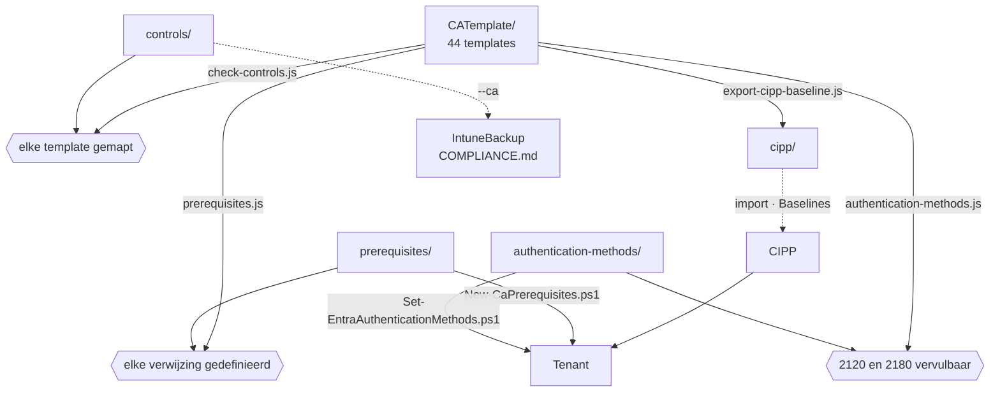

**Nederlands** · [English](README.en.md) · [Français](README.fr.md)

# scripts/

`CATemplate/` is de enige bron. Alles wat hier staat controleert die map en wat eraan vastzit,
leidt er de CIPP-export uit af, of zet de randvoorwaarden in een tenant — niets schrijft in
`cipp/` zonder dat `CATemplate/` het al weet.



## Node

| Script | Richting | Wat het doet |
|---|---|---|
| [`prerequisites.js`](prerequisites.js) | controle | Elke groep, named location, custom authentication strength en authentication context waar een template naar verwijst heeft een definitie in `prerequisites/ca-prerequisites.json`; named locations hebben in template en definitie dezelfde inhoud; geen template draagt een echt strength-id. Blokkerend in CI, en `export-cipp-baseline.js` roept hem zelf ook aan. |
| [`check-controls.js`](check-controls.js) | controle | Elk template heeft een normenmapping in `controls/ca-controls.json`, en geen mapping noemt een template dat niet bestaat. Staat de IntuneBackup-repo ernaast (`../IntuneBackup`), dan toetst hij ook de labels tegen `IntuneTemplate/_controls.json`. Blokkerend in CI. |
| [`authentication-methods.js`](authentication-methods.js) | controle | `authentication-methods/authentication-methods.json` spreekt zichzelf niet tegen, en `2120` en `2180` eisen geen methode die uit staat. Blokkerend in CI. |
| [`export-cipp-baseline.js`](export-cipp-baseline.js) | **uit** de bron | Schrijft `cipp/ca-templates-import.json` (de templates, zonder tenant-specifieke waarden) en `cipp/baseline-stages.json` (stage, state en actie per template). Leest `CATemplate/_manifest.json` voor de optionele templates. Alles op Report; `--remediate-stage1` zet stage 1 op Remediate, en weigert zolang er templates nieuw in stage 1 staan ten opzichte van de vorige export — `--accept-new` bevestigt die. |
| [`generate-docs.js`](generate-docs.js) | **uit** de bron | Schrijft `CATemplate/README.md` (en `.en`, `.fr`): elke policy met voor wie, wat, state en stage, en per policy een eigen README met het doel, de voorwaarden, de valkuilen, de normen en de Intune-policies waar hij van afhangt (uit `docs/policies.json`). Met de IntuneBackup-repo ernaast toetst hij ook of die Intune-paden bestaan en of elke compliance-policy in een groep staat. Draait ná de export, want de stage komt uit `cipp/baseline-stages.json`. `--check` schrijft niets en faalt als een README verouderd is; een test doet hetzelfde. |
| [`sync-mirror.js`](sync-mirror.js) | spiegel | Zet een tweede clone gelijk aan wat hier in git staat — zie [hieronder](#spiegelen-naar-een-tweede-clone). |
| [`set-organisation.js`](set-organisation.js) | organisatie | Zet de repo op een ander voorvoegsel (`CATemplate/_organisation.json`): tekst, bestandsnamen, daarna `cipp/` en de docs. |

Elk controlescript heeft een `*.test.js` ernaast; `node --test scripts/*.test.js` draait ze
allemaal. De tests bewaken ook wat de scripts zelf niet zien: dat de export in git volledig op
Report staat, dat er geen IP-range in de importbestanden lekt, en dat elke sleutel in
`_manifest.json` een bestaand template is.

## PowerShell

Alle drie vragen om PowerShell 7 (`pwsh`) en de Microsoft Graph-modules uit hun
`#Requires`-regel. Draai ze eerst met `-WhatIf` (of zonder `-Apply`).

| Script | Wat het doet |
|---|---|
| [`New-CaPrerequisites.ps1`](New-CaPrerequisites.ps1) | Maakt in een tenant de groepen, named locations, custom authentication strengths en authentication contexts uit `prerequisites/` aan. Idempotent. `-AllowedCountry` en `-ServiceAccountIpRange` voor de twee tenant-specifieke locaties, `-BreakGlassUserId` voor de break-glass-groepen, `-RequireSafeToDeploy` om af te breken zolang de kritieke groepen leeg zijn. Meldt het id van een aangemaakte custom strength, dat met de hand in de CIPP-uitrol moet. |
| [`Set-EntraAuthenticationMethods.ps1`](Set-EntraAuthenticationMethods.ps1) | Vergelijkt het authentication methods policy van een tenant met `authentication-methods/`; met `-Apply` zet hij de verschillen. `-CheckRegistrationFirst` weigert een methode uit te zetten zolang er gebruikers zonder MFA-methode zijn. Passkey-profielen meldt hij alleen. |
| [`Test-EntraPasskeyReadiness.ps1`](Test-EntraPasskeyReadiness.ps1) | Zegt vóór de uitrol per gebruiker of hij een passkey kán registreren, en zo niet: waarom. Alleen lezen. `-Scenario WindowsHelloPasskey \| SecurityKey \| WindowsHelloForBusiness`. |

## Volgorde

```bash
node scripts/prerequisites.js            # eerst: verwijst elk template naar iets wat bestaat?
node scripts/check-controls.js           # heeft elk template een normenmapping?
node scripts/authentication-methods.js   # spreken de aanmeldmethodes de templates niet tegen?
node scripts/export-cipp-baseline.js     # dan: cipp/ regenereren
node scripts/generate-docs.js            # CATemplate/README en de README per policy
node --test scripts/*.test.js            # laatst, want een deel kijkt naar cipp/
```

Die volgorde staat ook in [`.github/workflows/generate-cipp.yml`](../.github/workflows/generate-cipp.yml),
die na elke wijziging een PR opent met de geregenereerde `cipp/`. Op een pull request draait
hij dezelfde stappen zonder PR te openen.

In een tenant, ná een groene pijplijn:

```powershell
./scripts/New-CaPrerequisites.ps1 -TenantId <tenant> -WhatIf
./scripts/New-CaPrerequisites.ps1 -TenantId <tenant> -AllowedCountry 'NL','BE' -ServiceAccountIpRange '<cidr>' -BreakGlassUserId '<object-id>' -RequireSafeToDeploy
./scripts/Set-EntraAuthenticationMethods.ps1 -TenantId <tenant>
```

Pas daarna de baseline in CIPP, en pas als `New-CaPrerequisites.ps1` groen afsluit stage 1 op
Remediate.

## De CA-kant van COMPLIANCE.md

`controls/ca-controls.json` voedt `COMPLIANCE.md` in de IntuneBackup-repo. Staat die naast deze
gekloond als `../IntuneBackup`:

```bash
cd ../IntuneBackup
node scripts/generate-compliance.js --strict --ca ../CA-Policies/controls/ca-controls.json
```

Dat script leest per sleutel in `ca-controls.json` het bijbehorende template in `CATemplate/`,
voor zijn `state`. Een template hernoemen zonder de sleutel mee te nemen breekt die koppeling;
`check-controls.js` vangt dat hier af.

## Drie talen

Elk document staat er in het Nederlands (`X.md`), Engels (`X.en.md`) en Frans (`X.fr.md`), met
een taalbalk bovenaan. Nederlands is de bron; een wijziging in `X.md` hoort in dezelfde commit
ook in `X.en.md` en `X.fr.md`. Scripts, hun hulptekst en de workflow zijn Engels; de uitvoer van
de Node-scripts en de toelichtingen in de data (`purpose`, `reden`, `_comment`) blijven
Nederlands. Wat in de tenant terechtkomt — de omschrijving van een groep of een authentication
strength — is Engels.

## Spiegelen naar een tweede clone

`sync-mirror.js` hoort niet bij de pijplijn hierboven. Hij zet de bestanden in een tweede clone
gelijk aan wat hier in git staat en maakt daar één gewone commit van.

De spiegel houdt zijn eigen voorvoegsel: heeft zijn `CATemplate/_organisation.json` een ander
`prefix` dan hier, dan draait na het kopiëren `set-organisation.js` daar. Zo draagt alles hier
het voorvoegsel `CA - ` en in de spiegel bijvoorbeeld `CXNM - STANDARD - `. Heeft de doelclone nog
geen `_organisation.json`, dan weigert het script tot je het voorvoegsel één keer meegeeft:
`--prefix "CXNM - STANDARD - "`. Daarna staat het daar vast.

```bash
node scripts/sync-mirror.js <doelmap> --dry-run   # eerst kijken wat er zou verschuiven
node scripts/sync-mirror.js <doelmap> --push
```

Wat meegaat is `git ls-files`, niet wat er op de schijf ligt — daarmee blijft `local/` buiten de
spiegel, en dat is precies de reden om het niet met een kopieeropdracht te doen: één werkkopie met
tenant-specifieke waarden die naar een tweede remote lekt krijg je daar nooit meer uit.
Verwijderd is verwijderd, maar alleen voor bestanden die aan de andere kant in git staan; wat
daar lokaal is aangemaakt blijft met rust.

De doelclone houdt zijn eigen geschiedenis. Geen `push --force`, dus de commits, workflowruns en
branches aan die kant blijven staan — en dat is ook waarom het een script is en geen remote: een
tweede remote van deze repo zou die kant bij elke push overschrijven.

Draai het ná de volgorde hierboven, anders spiegel je een `cipp/` die nog achterloopt.
